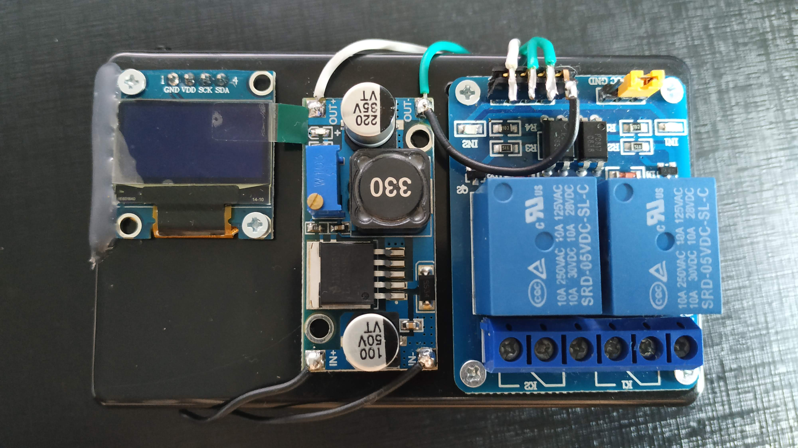
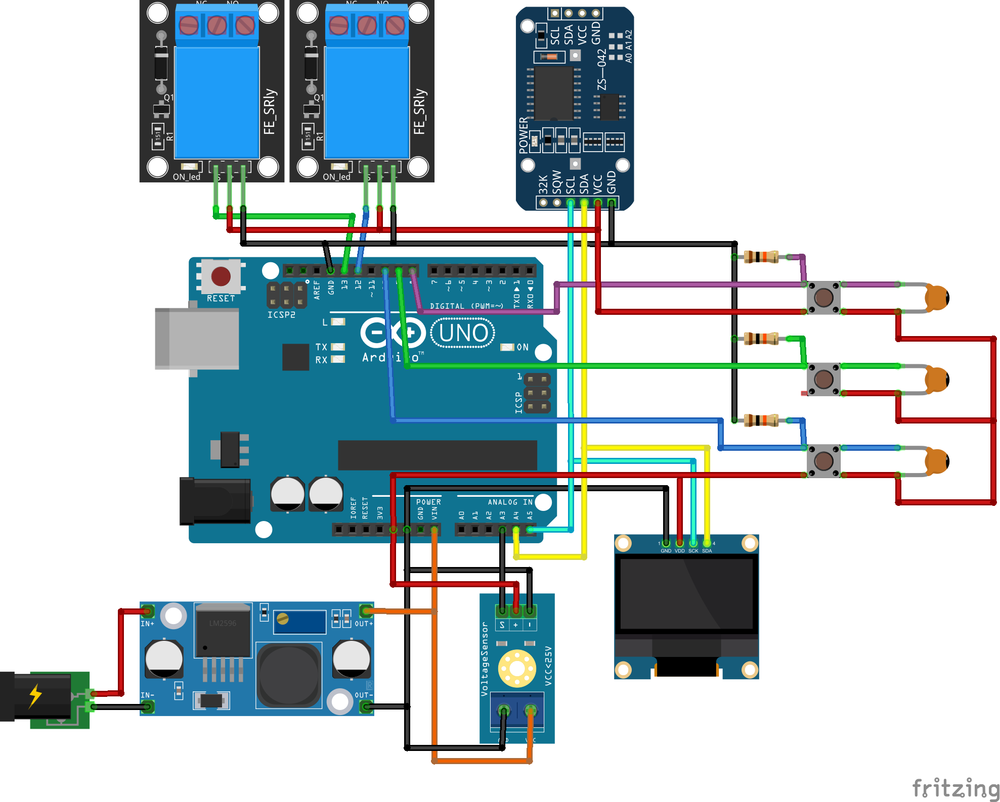
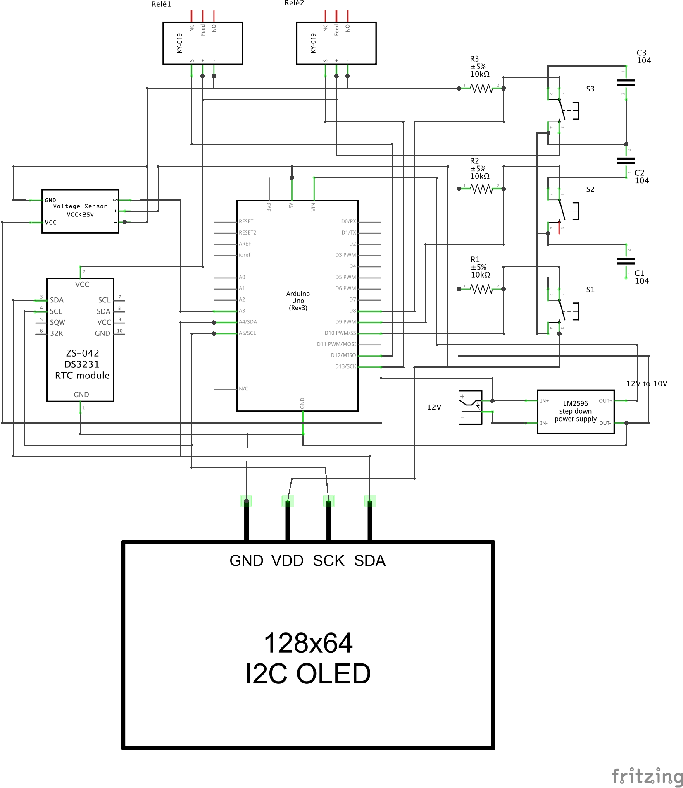

# Controlador de Carga
Controlador de Carga com Arduino UNO para uso num Inversor de Tensão.

Veja funcionando no [Youtube](https://youtu.be/0nAB2GfqSkk)

O Equipamento foi criado por mim, Judenilson Araujo, a partir da idéia de um amigo chamado Dennis Sousa, diante da necessidade de controlar o uso de um Inversor de tensão em sua residência, definindo horários específicos para ligar e desligar, bem como, a faixa de tensão específica para funcionamento das baterias.
Dennis já apareceu com vários shields facilitando o desenvolvimento, só tive que organizar numa caixa de montagem, inserir alguns botões e programar. É simples porém funcional e vai ajudar meu amigo com seu problema.
Caso queira copiar o projeto, fique a vontade. Se fizer alguma alteração no código que vai melhorá-lo, por favor, compartilhe conosco.

### Lista do material usado:

- Arduino UNO;
- Módulo Relé de 2 canais, 5V - 220V;
- Módulo Sensor de Tensão 0-25V DC;
- Módulo RTC (Real Time Clock) DS3231;
- Regulador de Tensão Step-Down LM2596;
- Display OLED 128x32;
- Caixinha de montagem;
- 3 botões táctil (Mini Switch);
- 3 resistores 10k;
- 3 Capacitores cerâmico de 100nF;
- Fios;

### Esquema desenhado no [Fritzing](https://www.fritzing.org)

